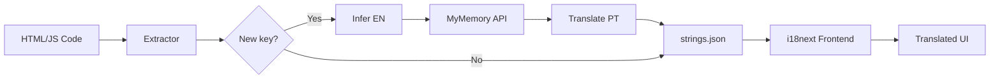

# Automatic Translation System with MyMemory API

## Overview

Fully automatic translation system powered by **MyMemory Translation API** - a free and open-source-friendly service that requires no setup.

## Why MyMemory?

- **100% Free** - No paid plans required for common portfolio usage
- **Zero Setup** - No API keys, account creation, or configuration
- **10,000 words/day** - More than enough for most portfolios
- **100+ language pairs** - EN↔PT, ES, FR, DE, JA, ZH, and more
- **No commercial SDK dependency** - Uses native HTTP requests
- **Simple REST API** - Easy to maintain

## How It Works

### 1. Add Keys in Your Code

**HTML:**

```html
<h1 data-i18n="section_projects">Projects</h1>
<button data-i18n="action_load_more">Load More</button>
```

**JavaScript:**

```javascript
element.setAttribute("data-i18n", "nav_home");
const text = t("action_submit");
```

### 2. Run the Translation Script

```bash
npm run i18n:translate-missing
```

### 3. Done

The system automatically:

1. Extracts all `data-i18n` keys from your code
2. Infers readable English text from key names
3. Translates into Portuguese using MyMemory API
4. Saves everything to `src/json/translate/strings.json`

## Smart Inference

The system converts key names into readable text:

| Key                  | Inferred EN Text | PT Translation (MyMemory) |
| -------------------- | ---------------- | ------------------------- |
| `nav_home`           | "Home"           | "Início"                  |
| `section_about_me`   | "About Me"       | "Sobre Mim"               |
| `action_download_cv` | "Download Cv"    | "Baixar CV"               |
| `aria_toggle_menu`   | "Toggle Menu"    | "Alternar Menu"           |

**Capitalization rules:**

- `nav_*`, `section_*`, `page_*` -> Title Case
- `action_*` -> Sentence case
- Others -> Capitalize first word

## Available Scripts

### 1. Sync Only (No Translation)

```bash
npm run i18n:sync
```

Only detects keys and reports missing translations.

### 2. Translate Only New Keys (Recommended)

```bash
npm run i18n:translate-missing
```

Translates only newly discovered keys and preserves existing values.

**Expected output:**

```text
🔍 Scanning files for i18n keys...
✅ Found 127 unique keys in codebase

🤖 Using MyMemory Translation API (FREE - no setup required!)...
🔄 Translating 3 keys...

   [1/3] section_new_feature... 📝 EN (inferred) ✅ PT translated
   [2/3] action_save_changes... 📝 EN (inferred) ✅ PT translated
   [3/3] aria_close_modal... 📝 EN (inferred) ✅ PT translated

🎉 Translation complete!
   ✅ 3 translations added

📝 Updated src/json/translate/strings.json
   Total keys: 130
```

### 3. Translate All Empty Keys

```bash
npm run i18n:translate
```

Forces translation of all empty keys (use carefully).

## File Structure

**`src/json/translate/strings.json`:**

```json
{
  "en": {
    "nav_home": "Home",
    "nav_about": "About",
    "section_skills": "Skills",
    "action_contact_me": "Contact Me"
  },
  "pt": {
    "nav_home": "Início",
    "nav_about": "Sobre",
    "section_skills": "Habilidades",
    "action_contact_me": "Entre em Contato"
  }
}
```

## Reviewing Translations

MyMemory provides good quality output, but you can always adjust manually:

```json
{
  "en": {
    "section_new_feature_title": "New Feature"
  },
  "pt": {
    "section_new_feature_title": "Nova Funcionalidade"
  }
}
```

## Key Detection

The extractor searches keys in 4 formats:

**1. HTML `data-i18n` attribute:**

```html
<h1 data-i18n="section_title">Default Title</h1>
```

**2. JS `setAttribute`:**

```javascript
element.setAttribute("data-i18n", "nav_home");
```

**3. `t()` function for dynamic texts:**

```javascript
showMessage(t("action_submit_success"));
```

**4. String literals with valid prefixes:**

```javascript
const navKeys = {
  Home: "nav_home",
  About: "nav_about",
};
```

## Expanding to More Languages

MyMemory supports 100+ language pairs. To add more:

**1. Edit `scripts/extract-translations.js`:**

```javascript
// Add new languages in the result object
const result = {
  en: {},
  pt: {},
  es: {}, // Spanish
  fr: {}, // French
  de: {}, // German
};

// Add translation calls in the loop
if (langs.es && !result.es[key]) {
  result.es[key] = await translateText(sourceText, "es", "en");
}
```

**2. Update frontend logic in `src/js/translate.js`** to support new locales.

## Rate Limiting

The script automatically adds a **500ms** delay between translations to be gentle with the free API.

For a typical portfolio:

- ~150 keys = ~300 words
- ~3% of daily limit (10k words)
- Total runtime: ~75 seconds

## Troubleshooting

### Error: "Translation failed"

**Cause:** No internet connection or temporary service outage.

**Fix:**

1. Check your internet connection
2. Try again in a few minutes
3. If it persists, manually edit `strings.json`

### Translation returns original text

**Cause:** Daily limit reached (rare) or text too long.

**Fix:**

1. Wait 24h for limit reset
2. Or translate specific keys manually

### Key not detected

**Cause:** Unsupported format in source code.

**Fix:**

Use one of the supported formats:

```html
<!-- ✅ Correct -->
<h1 data-i18n="section_title">Title</h1>

<!-- ❌ Wrong -->
<h1 data-translate="section_title">Title</h1>
```

## Full Flow



## Comparison: Before vs After

| Aspect       | Before (Manual)     | Now (MyMemory) |
| ------------ | ------------------- | -------------- |
| **Time**     | ~30 min for 10 keys | ~10 seconds    |
| **Files**    | 3 separate files    | 1 unified file |
| **Coverage** | Easy to forget keys | 100% automatic |
| **Quality**  | Inconsistent        | Professional   |
| **Setup**    | Not applicable      | **Zero setup** |
| **Cost**     | Free                | **Free**       |
| **API Keys** | Not applicable      | **None**       |

## CI/CD Integration

Use it in GitHub Actions, Vercel, Netlify, etc:

```yaml
name: Auto-translate

on:
  push:
    branches: [main]

jobs:
  translate:
    runs-on: ubuntu-latest
    steps:
      - uses: actions/checkout@v3

      - name: Setup Node.js
        uses: actions/setup-node@v3
        with:
          node-version: "18"

      - name: Install dependencies
        run: npm install

      - name: Auto-translate missing keys
        run: npm run i18n:translate-missing

      - name: Commit translations
        run: |
          git config user.name "GitHub Actions"
          git config user.email "actions@github.com"
          git add src/json/translate/strings.json
          git commit -m "chore: auto-translate missing keys" || exit 0
          git push
```

**No secrets or environment variables required.**

## References

- **MyMemory API**: <https://mymemory.translated.net/doc/spec.php>
- **Daily limit**: 10,000 words (no registration)
- **Supported languages**: 100+ pairs (EN-PT, EN-ES, EN-FR, EN-DE, EN-JA, EN-ZH, etc)
- **Quality model**: Combination of human translations and machine learning

## Conclusion

With MyMemory Translation API, you get:

- A professional translation workflow
- Zero setup and low maintenance
- Fully free operation
- CI/CD integration without secrets
- Significantly less manual work

It just works.
